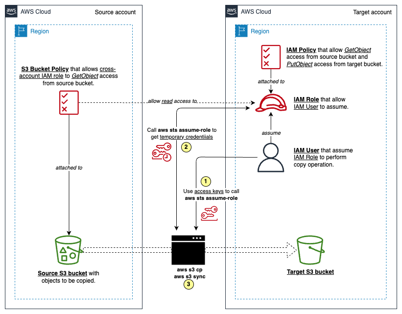

# Copy data from an S3 bucket to another account and Region by using the AWS CLI

This AWS pattern migrates objects from an Amazon S3 bucket in an AWS account to another S3 bucket in a different account or region.

## Architecture



- The source S3 bucket allows *GetObject* permission through an attached resource policy, typically a *S3 Bucket Policy*.
- In the target account, an IAM user (*temp-user*) needs to assume an IAM role granting *PutObject* permission for the target bucket and *GetObject* permission for the source bucket.
- Finally, execute *copy* or *sync* commands to transfer data from the source S3 bucket to the target S3 bucket.

---

## Prerequisites

- A source AWS account with an IAM user that has required permissions to create/update/delete resources by Terraform CLI.
- A target AWS account with an IAM user that has required permissions to create/update/delete resources by Terraform CLI.
- Access keys of those IAM Users from both accounts.
- An S3 bucket of the source AWS account in a particular region with some objects to be copied.
- An empty S3 bucket of the target AWS account in a particular region.
- Terraform (version >= 0.13)

---

## Tasks

Create `terraform.tfvars` to define variables for Terraform as follows:

```
src_aws_region     = "<source-aws-account-region>"
src_aws_access_key = "<source-aws-account-access-key>"
src_aws_secret_key = "<source-aws-account-secret-key>"
src_s3_bucket_name = "<source-aws-s3-bucket-name>"
tgt_aws_region     = "<target-aws-account-region>"
tgt_aws_access_key = "<target-aws-account-access-key>"
tgt_aws_secret_key = "<target-aws-account-secret-key>"
tgt_s3_bucket_name = "<target-aws-s3-bucket-name>"
```

Initialize the project, plan, and apply the resource changes into the local state file by:

```sh
terraform init
terraform plan -out /tmp/tfplan
terraform apply /tmp/tfplan
```

---

## Verification

<TODO>

Run the following commands to set up environment variables for AWS CLI with AWS access keys of the newly created *temp-user* IAM User of the target account:

```sh
# Set up AWS access keys of temp-user
export AWS_ACCESS_KEY_ID=$(terraform output -raw tgt_temp_user_access_key_id)
export AWS_SECRET_ACCESS_KEY=$(terraform output -raw tgt_temp_user_access_key_secret)
```

Assume *S3MigrationRole* by *temp-user* and replace environment variables for AWS CLI with the newly received temporary access keys from `aws sts assume-role` command:

```sh
# Assume S3MigrationRole by temp-user and set up temporary access keys
export TARGET_S3_MIGRATION_ROLE_ARN=$(terraform output -raw tgt_s3_migration_role_arn)
export $(printf "AWS_ACCESS_KEY_ID=%s AWS_SECRET_ACCESS_KEY=%s AWS_SESSION_TOKEN=%s"  \
  $(aws sts assume-role \
    --role-arn "$TARGET_S3_MIGRATION_ROLE_ARN" \
    --role-session-name AWSCLI-Session \
    --query "Credentials.[AccessKeyId,SecretAccessKey,SessionToken]" \
    --output text))
```

Verify that currently AWS CLI actually assumes the *S3MigrationRole* role by:

```sh
aws sts get-caller-identity
```

Before running *copy* or *sync* command, set up the following variables:

```sh
export SRC_BUCKET_NAME=$(terraform output -raw src_s3_bucket_name)
export SRC_REGION=$(terraform output -raw src_aws_region)
export TGT_BUCKET_NAME=$(terraform output -raw tgt_s3_bucket_name)
export TGT_REGION=$(terraform output -raw tgt_aws_region)
```

Run the following command to *copy* all objects from a folder in the source S3 bucket into another folder on the target S3 bucket:

```sh
aws s3 cp s3://$SRC_BUCKET_NAME/src-folder-path/ \
  s3://$TGT_BUCKET_NAME/tgt-folder-path/ \
  --recursive --source-region $SRC_REGION --region $TGT_REGION
```

Or, you can *sync* all of the objects in the source S3 bucket with the target S3 bucket:

```sh
aws s3 sync "s3://$SRC_BUCKET_NAME/" \
  "s3://$TGT_BUCKET_NAME/" \
  --source-region $SRC_REGION --region $TGT_REGION
```

---

## Clean up

To clean up the whole stack by deleting all of the resources, run the following command:

```sh
terraform destroy
```

If `-auto-approve` is set, then the destroy confirmation will not be shown:

```sh
terraform destroy -auto-approve
```

---

## References

- [Copy data from an S3 bucket to another account and Region by using the AWS CLI](https://docs.aws.amazon.com/prescriptive-guidance/latest/patterns/copy-data-from-an-s3-bucket-to-another-account-and-region-by-using-the-aws-cli.html)
- [AWS sts assume role in one command](https://stackoverflow.com/questions/63241009/aws-sts-assume-role-in-one-command)

---
